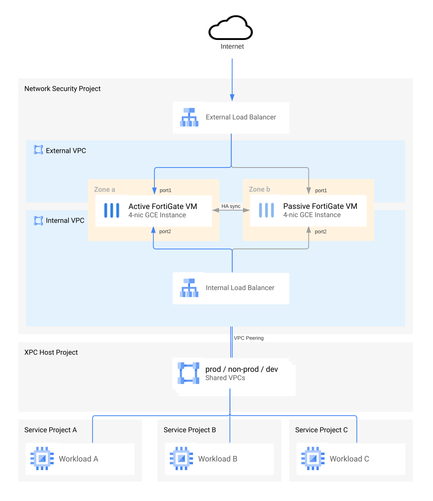

#### FortiGate Deployment Tutorial for Google Cloud
# Deployment Manager

This directory contains Deployment Manager (DM) templates to deploy and configure FortiGate reference architecture in Google Cloud. It builds the complete configuration in a single deployment. Note that the FortiGate configuration is provided as a bootstrap script and applying any changes to FortiGate configuration after deployment completes is NOT possible by updating the code - it requires re-deploying of FortiGate instances.

For details on the deployed tutorial architecture check [this article](../docs/architecture-tutorial.md).

**Note:** *templates in this directory use Deployment Manager actions. It is not an officially supported DM feature and will trigger warnings.*

## Files

This directory contains the following files:
- `config.yaml` - main configuration file defining what templates and with what parameters should be deployed
- `fgcp-ha-ap-multilb.jinja(.schema)` - DM template for deploying an HA cluster of FortiGates in load-balancer sandwich; uses `singlevm2.jinja`
- `peerings.jinja(.schema)` - DM template for creating peered hub-and-spoke architecture
- `sample-networks.jinja` - helper DM template to streamline creation of example VPCs and subnets used in this tutorial
- `singlevm2.jinja(.schema)` - DM template creating a single FortiGate VM; used by `fgcp-ha-ap-multilb.jinja`
- `utils-images.jinja` - jinja macro for identifying FortiGate images
- `utils-netcalc.jinja` - jinja macro for calculating IP addresses; used by `singlevm2.jinja` and `fgcp-ha-ap-multilb.jinja`
- `workload.jinja` - DM template creating simple proxy and web server VMs used by this tutorial

## Prerequisites
#### Service account
FortiGate uses its External Fabric Connector (a.k.a. SDN Connector) to support firewall policies based on GCE metadata instead of just IP addresses. In order for Connector to function, the FortiGate instances must be given access to all needed projects. It is highly recommended to use the minimum set of privileges by creating a custom role and a service account using `[service_account_create.sh]`(../../service_account_create.sh) script and providing service account name in `serviceAccount` property of `My_FortiGate_Cluster` resource. Otherwise the default GCE account will be used.

#### Licenses
This tutorial uses BYOL-licensed images. You must obtain and activate your licenses before running terraform configuration. The `.lic` files must be downloaded from [support.fortinet.com](https://support.fortinet.com) portal and put in the day0 directory as `lic1.lic` and `lic2.lic`. If you prefer to use the PAYG images you'll have to:

1. remove the reference to the files from the imports section of [config.yaml](config.yaml) file (lines 7-11)
1. remove whole `licenses` property from `My_FortiGate_Cluster` resource (it will default to PAYG) in [config.yaml](config.yaml) file (lines 52-57)

## How to deploy

Deployment Manager templates can be deployed only using Google Cloud CLI. You can use the Cloud Shell or your own machine with gcloud installed. Afterwards the deployment will be visible in the [Deployment Manager](https://console.cloud.google.com/dm/deployments) section of GCP web console.

1. clone this git repository to copy the IaC code
2. make sure you have uploaded license files to your working directory
3. run `gcloud deployment-manager deployments create fgt-tut --config config.yaml` replacing "fgt-tut" with your desired deployment name (it will be also used as a prefix for all resources)
4. use the default password, management IPs and service IP from the command output to [verify the deployment](../docs/verify-deployment.md).

## How to clean up

You can either use the web console to delete your deployment or do it using the command below:

`gcloud deployment-manager deployments delete fgt-tut`
