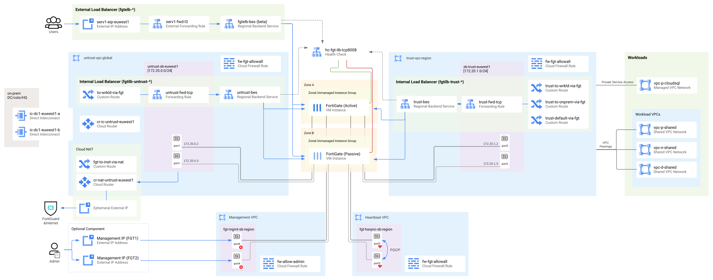
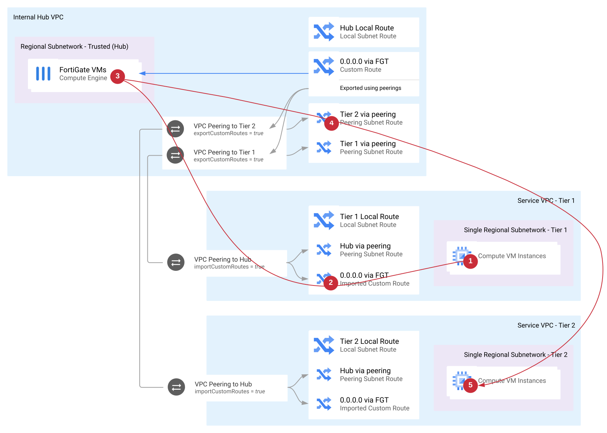

#### FortiGate Deployment Tutorial for Google Cloud
# FortiGate Reference Architecture for GCP

Reference architecture features the following building blocks:
1. Active-Passive HA cluster
1. Peering-based hub and spoke

* [Active-Passive HA cluster](#active-passive-ha-cluster)
* [Peering-based hub and spoke](#peering-based-hub-and-spoke)
* [Supported Use-Cases](#supported-use-cases)
    - [Protecting public services (ingress N-S inspection)](#protecting-public-services-ingress-n-s-inspection)
    - [Secure NAT Gateway (outbound N-S inspection)](#secure-nat-gateway-outbound-n-s-inspection)
    - [Segmentation for multi-tier infrastructure (E-W inspection)](#segmentation-for-multi-tier-infrastructure-e-w-inspection)
    - [ Secure Hybrid Cloud (IPS for Interconnect)](#secure-hybrid-cloud-ips-for-interconnect)
    - [Private Service Connect](#private-service-connect)
    - [SD-WAN / Remote Access](#sd-wan--remote-access)

## Active-Passive HA cluster

This architecture uses 2 FortiGate instances in an Active-Passive HA cluster between set of load balancers ("load balancer sandwich" pattern). LB Sandwich design enables use of multiple public IPs and provides faster, configurable failover times when compared to SDN connector-based approach.
Note that at the moment Google Cloud feature allowing sustaining existing connections upon HA failover ([connectionTracking.connectionPersistenceOnUnhealthyBackends](https://cloud.google.com/load-balancing/docs/internal#connection-persistence)) is available in preview.

HA multi-zone deployments provide **99.98%** Compute Engine SLA vs. **99.5%** for single instances. See [Google Compute Engine SLA](https://cloud.google.com/compute/sla) for details.

### FortiGate Clustering Protocol (FGCP) in public cloud
[FGCP](https://docs.fortinet.com/document/fortigate/7.0.3/administration-guide/62403/fgcp) is a proprietary protocol used to create high-availability clusters in both hardware and virtual FortiGate deployments. Due to the way cloud networks work, you cannot take full advantage of the protocol capabilities and you have to use its unicast version limiting the functionality to active-passive cluster of two instances.

FGCP will provide automatic synchronization of connection tables as well as synchronization of configuration from primary to secondary (all configuration changes need to be applied to the primary instance). It's recommended to use priority option to assign statically the primary and secondary roles in the cluster.

### VM instances and networks
FortiGates are deployed as 2 VM instances in 2 different availability zones of the same region, with 4 NICs each:
- port1 (nic0) - external (untrusted) traffic
- port2 (nic1) - internal (trusted) traffic
- port3 (nic2) - heartbeat and FGCP configuration sync
- port4 (nic3) - dedicated management interface

*Note that more internal NICs might be needed if the number of security zones (VPCs) in east-west segmentation use-case exceeds maximum size of a peering group (25).*

*Note2: starting from firmware 7.0 you can use the same NIC for FGCP heartbeat and management*

Machine type depends on your use-case, but to accommodate for 4 NICs it must have 4 vCPUs or more. We recommend starting with N2-standard-4 instance for firewalling and threat inspection use-cases and with C2-standard-4 if the main use-case is VPN-related.

You should create and attach a logdisk to each instance to store log data.

FortiGates would be configured in a unicast FGCP active-passive cluster with heartbeat over port3 and dedicated management on port4. Port4 can be optionally linked to an external IP unless the private IP addresses of the interfaces are available in another way (e.g. via VLAN attachment). No other NICs need public IP addresses. Port3 needs a static private IP address as it's part of the configuration of the peer instance in the cluster. Other NICs can be configured with static IP addresses for consistency.

Outbound connections from port1 to Google Compute API and FortiGuard services must be made available, preferably using Cloud NAT or using public IPs attached directly to port1 of each VM.

### Load Balancers and traffic flows
Cloud infrastructure directs traffic flows to the active FortiGate instance using load balancers. In this case load balancers will not really balance the connections but simply direct them to the single active (healthy) instance and not to the passive (unhealthy) one. Both Internal and External Load Balancers in GCP can use a Backend Service as the target. You will have to create a separate regional Backend Service resource for each interface receiving production traffic (port1 and port2, but not port3 and port4) as well as a Forwarding Rule to bind a load balancer frontend IP address with the backend service. You can re-use the same Unmanaged Instance Groups for all Backend Services. Mind that in case of processing both the traffic from public Internet as well as traffic from Interconnect you will have to create both external and internal load balancer for port1. When creating load balancers using web console their internal components (Backend Service, Forwarding Rule) might be not explicitly visible.

Internal Load Balancers will be [used as next hop by custom routes](https://cloud.google.com/load-balancing/docs/internal/ilb-next-hop-overview) and it's enough to use a single rule for any port of either TCP or UDP protocol. Custom route will automatically enable routing of all TCP/UDP/ICMP traffic on all ports.

External Load Balancer does not support routing, so the connections to its public IP addresses will have to be terminated or redirected (DNATed) on the active FortiGate. It's recommended to use the new L3_DEFAULT protocol for ELB.

### Health Checks and HA Failover
Load Balancers detect active instance using [health checks](https://cloud.google.com/load-balancing/docs/health-check-concepts). There are 3 possibilities to handle the health probes:

1. [Responding to probes](https://docs.fortinet.com/document/fortigate/7.0.1/cli-reference/123620/config-system-probe-response) directly on the FortiGate using secondary IP addresses of the interface - this is the easiest solution recommended in most cases (requires least configuration on FortiGate), but it's limited by the maximum number of secondary addresses
2. Creating additional loopback interface and redirecting probes to it using VIPs - this solution is recommended if you create FortiGate configuration using terraform as (unlike secondary IPs) the VIPs and firewall policies can be easily created and destroyed. It's also recommended to use this approach if you have many public IP addresses.
3. Forwarding probes to the backend server - this solution is not recommended as a failover of a single backend service will attempt to fail over whole firewall cluster, which in many cases will not match the FGCP status.

[Connection Tracking](https://cloud.google.com/load-balancing/docs/internal#connection-persistence) feature of GCP load balancers (in preview at the time of writing) allows graceful failover of existing connections. Use it if your organization policy allows using Google Compute Beta API.

## Peering-based hub and spoke

While VPC peerings in Google Cloud are not transitive (Spoke A and Spoke B peered with Hub cannot connect to each other), using a custom static route and a routing virtual appliance enables transitiveness. In this setup the (default) custom route created in the hub VPC with the next hop set to the ILB in front of the FortiGate cluster will be exported using `exportCustomRoutes` parameter. On the spoke VPC side of the peering `importCustomRoutes` option installs the custom route into the local routing table with next hop set to the peering. This way, all the packets leaving a spoke  VPC - if not addressed to a directly peered network - will be sent to the FortiGate cluster. FortiGate, after processing, will release the packet either to the Hub VPC where it will be routed to destination spoke VPC or to the external VPC where it will be routed outside of GCP.

## Prerequisites

**Service account** is a type of GCP IAM account dedicated for use by VMs and services. When deploying any VM in GCP you can assign it a service account, which the VM will be using to connect to GCP APIs. VM can download temporary tokens for its service account from the private metadata service (169.254.169.254) thus removing the necessity to manually handle service account keys (generating keys for service account should be always your last option).

FortiGate uses service account during boot-up to verify it actually is running in Google Cloud, as well as in Fabric Connector (a.k.a. SDN Connector) so it can use of metadata instead of IP addresses in firewall address objects. By default all new VMs are assigned the built-in *Default Compute Engine Service Account*, which by default has project Owner role. Following the minimum privilege principle you SHOULD create a dedicated role and account for your FortiGate appliances. Check [here](sdn_privileges.md) for more information on how to create them and what are the required privileges your FortiGates do need.

## Solution costs
Note that besides FortiGate license fees you will have to cover the costs of the following GCP infrastructure:
- 2 VM instances supporting 4 or more NICs
- Forwarding rules
- inter-zonal heartbeat traffic
- VM disk storage

Use Google [Cloud Pricing Calculator](https://cloud.google.com/products/calculator/#id=41ff2e84-f518-4b22-a396-71effe7682db) for cost estimate.

## Supported use-cases
### Protecting public services (ingress N-S inspection)

FortiGate instances empowered by FortiGuard services can be used to secure your workloads running in the cloud against any bad actors accessing them from the Internet. Publishing your services via FortiGate allows you to not only scan traffic against malicious payload, but also provide granular access rules or enforce ZTNA policies.

To publish a service via FortiGate the following components are used:
- new public IP address and external network load balancer in GCP
- VIP and firewall policy in FortiGate
- internal load balancer and a static custom route to handle return flow

Although the workloads could be deployed directly into trusted VPC, they are usually placed in separate VPC (often in a different project), which is peered with trusted. You can use simple or shared VPCs for hosting workloads.

### Secure NAT Gateway (outbound N-S inspection)

FortiGate is a great choice to replace the Cloud NAT service. You can easily regulate Internet access based on VM metadata and grant very selective access to services while adding AV scanning on top to make sure your workloads remain healthy.

To enable Internet access the following changes are added:
- internal load balancer as next-hop for the custom static route
- FortiGate IP Pool object and an outbound firewall policy
- (optionally) external load balancers and public IP addresses

ELB forwarding rules are used to bind public addresses to the FortiGate cluster, so you can specify in the FortiGate policy which public IP address should be used for a given type of traffic. Both external and internal load balancers are shared with the ingress north-south use-case.

### Segmentation for multi-tier infrastructure (E-W inspection)

East-west inspection in GCP can be provided only for traffic between VPC Networks (not inside a network), thus each security zone needs to be created as a separate VPC. Traffic between all workload VPCs properly peered to the FortiGate trusted VPC will be inspected by FortiGate VMs.

To enable east-west scanning use VPC peering with custom route export/import.

Note: The size of a single peering group is limited by GCP to 25 peers, but the number of supported security zones can be increased by adding more internal NICs to the FortiGate (effectively connecting it to multiple peering groups). Contact us if you need an architecture modification because of the number of security zones.

### Secure Hybrid Cloud (IPS for Interconnect)

When connecting your datacenters to the cloud using Interconnect you often need to enforce additional security controls between them. FortiGate high-throughput IPS engine as well as cloud metadata awareness is a great help in securing this internal perimeter.

To inspect traffic between on-prem available via Interconnect and the cloud you will use:
- custom route pointing to internal load balancer on the Interconnect side of the FortiGate
- custom route pointing to another internal load balancer for the cloud-to-onprem flow

### Private Service Connect

While migrating applications to the public cloud you might want to use PaaS services like Cloud SQL. Protecting access to your CloudSQL and making it available from both cloud and on-prem might seem challenging, but can be easily achieved using FortiGate Secure Services Hub.

This solution uses set of custom routes and load balancers to direct traffic from peered VPC Networks and from on-prem via FortiGate appliances in GCP just like in the segmentation use-case.

Keep in mind that currently it is possible to create only one PSC per VPC, which means this architecture is not suitable for those organizations which need separate services (eg. for staging and production).

### SD-WAN / Remote Access

Providing access to remote users as well as from micro, small and large offices using VPN, SD-WAN or ZTNA technologies is one of the most common use-cases for FortiGates in the public cloud. This use-case follows the same setup as the Ingress N-S Inspection and does not have dedicated templates or deployment scripts.

VPN tunnels should be built towards ELB public IP address, which is to be added as secondary IP to the port1 interface.
