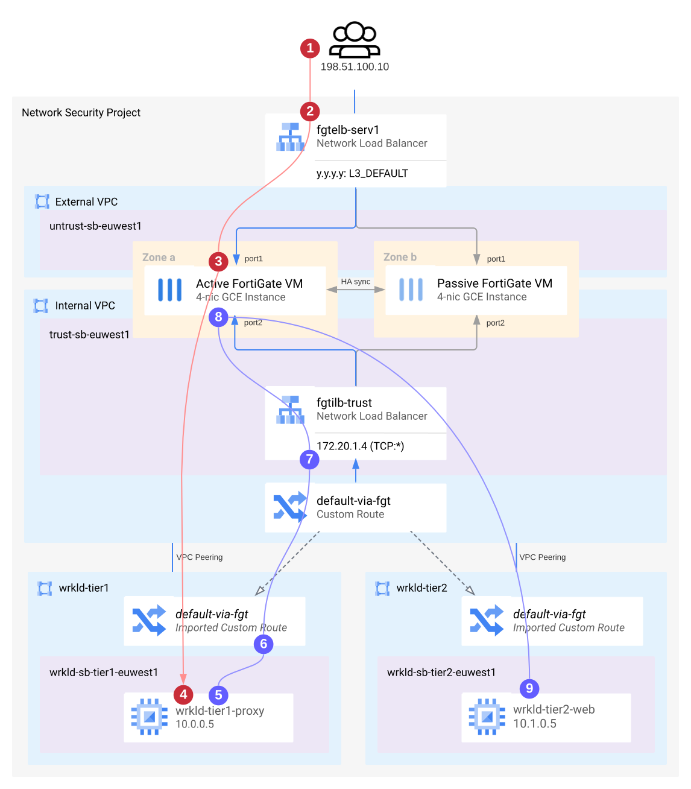

#### FortiGate Deployment Tutorial for Google Cloud
# Tutorial Architecture

This tutorial architecture is based on the most common design described in detail [here](architecture-reference.md). It consists of an HA cluster of 2 FortiGates 7.0 and a very basic web application with a single VM with a proxy server (tier 1) and a single VM running a web server (tier2) deployed in peered VPCs.

The tutorial setup demonstrates the following use-cases:
* North-South inspection for inbound connections
* South-North inspection for outbound connections (secure web gateway)
* East-West segmentation

An HTTP connection initiated from the Internet will be passing through the following steps:
1. Client initiates a connection to external load balancer public IP
2. External load balancer relays the connection to the active FortiGate instance port1
3. FortiGate performs DNAT, inspects the connection for threats and releases it via port2
4. Connection is sent over VPC peering and terminated on wrkld-tier1-proxy
5. Proxy initiates connection to the web server (wrkld-tier2-web)
6. Imported custom route sends the connection over peering to the internal load balancer
7. Internal load balancer forwards connection to the active FrtiGate
8. FortiGate inspects connection
9. Connection is sent via VPC peering to tier 2 VPC and terminated by wrkld-tier2-web
